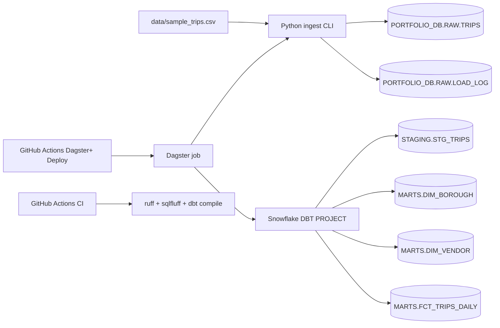

# snowflake-dbt-orchestrated-pipeline

Production-style ELT portfolio project: Python ingestion loads reproducible trip data into Snowflake `RAW`, transformations are executed natively in Snowflake using `EXECUTE DBT PROJECT`, and orchestration is managed in Dagster (local dev + Dagster Cloud deployment). The repo includes CI, SQL linting, and pre-commit hooks, and is designed to run safely on a Snowflake trial account.

## Architecture



## Why this project

- Demonstrates clear data layers (`RAW`, `STAGING`, `MARTS`) with idempotent setup.
- Uses a realistic ingestion pattern with load auditing (`RAW.LOAD_LOG`).
- Runs dbt natively in Snowflake (`CREATE/EXECUTE DBT PROJECT`) to mirror modern platform-native transformation patterns.
- Includes orchestration and scheduling in Dagster with cloud deployment via GitHub Actions.
- Enforces engineering hygiene: tests, linting, CI, and reproducible local data.

## Repo layout

- `data/sample_trips.csv`: committed sample dataset (~10k rows).
- `scripts/generate_sample_data.py`: deterministic data generator.
- `scripts/set_dagster_cloud_env_vars.py`: one-shot sync of Snowflake env vars to Dagster Cloud secrets.
- `pipeline/`: Snowflake connection utils, ingestion CLI, native dbt CLI.
- `dbt/`: dbt project models/tests/docs metadata.
- `orchestration/`: Dagster jobs/schedule definitions.
- `sql/native_dbt/`: Snowflake SQL templates for Git repo + DBT PROJECT objects.
- `dagster_cloud.yaml`: Dagster Cloud code location configuration.
- `.github/workflows/ci.yml`: lint + SQL lint + dbt compile checks.
- `.github/workflows/dagster-plus-deploy.yml`: Dagster Cloud deployment workflow.

## Snowflake setup

1. Create a warehouse (recommended):
- Size: `X-Small`
- Auto-resume: ON
- Auto-suspend: `60` seconds

2. Configure environment variables:

```bash
cp .env.example .env
```

3. Fill `.env`:

Required base fields:
- `SNOWFLAKE_ACCOUNT`
- `SNOWFLAKE_USER`
- `SNOWFLAKE_ROLE`
- `SNOWFLAKE_WAREHOUSE`

Auth mode A (password):
- `SNOWFLAKE_AUTHENTICATOR=snowflake`
- `SNOWFLAKE_PASSWORD=...`

Auth mode B (PAT / OAuth):
- `SNOWFLAKE_AUTHENTICATOR=oauth`
- `SNOWFLAKE_TOKEN=...`

Note: account can be either `xy12345.us-east-1` or full host like `xy12345.us-east-1.snowflakecomputing.com`.

## Quickstart (local)

```bash
make install
make ingest
make dbt-build
dagster dev -f orchestration/definitions.py
```

This local path keeps dbt Core available for development/compile/docs and interview demos.

## Native dbt in Snowflake (recommended runtime)

### 1) Create Snowflake Git + DBT PROJECT objects

Use the SQL templates in `sql/native_dbt/` or run the CLI-backed deploy command:

```bash
make native-dbt-deploy
```

Prerequisite: `make native-dbt-deploy` expects an existing Snowflake `GIT REPOSITORY` object
(`PORTFOLIO_DB.RAW.PORTFOLIO_GIT_REPO` by default). Create it first with
`sql/native_dbt/01_create_git_repository.sql` after configuring your Snowflake GitHub API integration.

`make native-dbt-deploy` uses:
- `SNOWFLAKE_DBT_PROJECT_FQN`
- `SNOWFLAKE_DBT_GIT_REPO_FQN`
- `SNOWFLAKE_DBT_BRANCH`
- `SNOWFLAKE_DBT_PROJECT_ROOT`
- `SNOWFLAKE_DBT_DEFAULT_TARGET`

### 2) Execute dbt natively

```bash
make native-dbt-execute
```

Equivalent Snowflake SQL:

```sql
execute dbt project PORTFOLIO_DB.MARTS.TRIPS_DBT_PROJECT
  args = 'build --target prod';
```

### 3) Run from Dagster

The Dagster job (`orchestration/definitions.py`) runs:
1. ingestion (`python -m pipeline.ingest --full-refresh`)
2. native dbt execution (`EXECUTE DBT PROJECT ...`)

Schedule:
- Daily at `07:00` America/New_York.

## dbt models and tests

### Models

- `stg_trips`: type casting + cleaning + derived fields (`trip_minutes`, `avg_speed_mph`, `pickup_date`).
- `dim_borough`: distinct borough dimension with surrogate key.
- `dim_vendor`: distinct vendor dimension with surrogate key.
- `fct_trips_daily` (incremental): aggregate by `pickup_date`, `vendor_id`, `pickup_borough`.

Metrics in `fct_trips_daily`:
- `trips`
- `total_fare`
- `total_tip`
- `total_amount`
- `avg_distance`
- `avg_trip_minutes`

### Tests

- `not_null` / `unique` on `stg_trips.trip_id`
- `accepted_values` on `payment_type` (`Card`, `Cash`, `Other`)
- non-negative checks via `dbt_utils.expression_is_true`
- relationship tests from fact to dimensions
- unique daily grain on fact via `dbt_utils.unique_combination_of_columns`

### What “incremental” means here

`fct_trips_daily` is materialized as incremental with `delete+insert` and a composite key (`pickup_date`, `vendor_id`, `pickup_borough`). Re-runs upsert at that grain instead of rebuilding from scratch.

## dbt docs

Local docs (dbt Core):

```bash
make dbt-deps
dbt docs generate --project-dir dbt --profiles-dir dbt --target dev
dbt docs serve --project-dir dbt --profiles-dir dbt
```

Native Snowflake docs generation:

```sql
execute dbt project PORTFOLIO_DB.MARTS.TRIPS_DBT_PROJECT
  args = 'docs generate --target prod';
```

## Dagster Cloud setup

1. Commit/push this repo to GitHub.
2. In GitHub repo settings, add secret:
- `DAGSTER_CLOUD_API_TOKEN`
3. Confirm org slug in `.github/workflows/dagster-plus-deploy.yml`:
- `DAGSTER_CLOUD_ORGANIZATION: "th"`
4. Push to `main` or open a PR to trigger deployment workflow.

Dagster Cloud config file used by CI/CD:
- `dagster_cloud.yaml`

### Sync runtime env vars to Dagster Cloud (recommended)

This repo includes a helper to push the required Snowflake runtime vars into Dagster Cloud
as deployment-global secrets (full + branch scopes by default), without committing secrets:

```bash
read -s DAGSTER_CLOUD_API_TOKEN
export DAGSTER_CLOUD_API_TOKEN
make dagster-cloud-env-sync
unset DAGSTER_CLOUD_API_TOKEN
```

The sync command reads Snowflake values from `.env` (or shell env overrides) and uploads:

- `SNOWFLAKE_ACCOUNT`
- `SNOWFLAKE_USER`
- `SNOWFLAKE_ROLE`
- `SNOWFLAKE_WAREHOUSE`
- `SNOWFLAKE_AUTHENTICATOR`
- `SNOWFLAKE_TOKEN` or `SNOWFLAKE_PASSWORD` (depending on authenticator)
- `SNOWFLAKE_DATABASE`
- `SNOWFLAKE_SCHEMA_RAW`
- `SNOWFLAKE_SCHEMA_STAGING`
- `SNOWFLAKE_SCHEMA_MARTS`
- `SNOWFLAKE_DBT_PROJECT_FQN`
- `SNOWFLAKE_DBT_ARGS`

## CI

`/.github/workflows/ci.yml` runs on push/PR:
- `ruff check .`
- `ruff format --check .`
- `sqlfluff lint dbt/models`
- `dbt deps`
- `dbt compile --target ci`

No Snowflake warehouse credentials are required for CI compile.

Optional: run full dbt build in CI if Snowflake secrets are configured:

```yaml
# - name: dbt build (optional, requires Snowflake creds)
#   env:
#     SNOWFLAKE_ACCOUNT: ${{ secrets.SNOWFLAKE_ACCOUNT }}
#     SNOWFLAKE_USER: ${{ secrets.SNOWFLAKE_USER }}
#     SNOWFLAKE_PASSWORD: ${{ secrets.SNOWFLAKE_PASSWORD }}
#     SNOWFLAKE_ROLE: ${{ secrets.SNOWFLAKE_ROLE }}
#     SNOWFLAKE_WAREHOUSE: ${{ secrets.SNOWFLAKE_WAREHOUSE }}
#   run: dbt build --project-dir dbt --profiles-dir dbt --target dev
```

## Cost control

- Keep warehouse at `X-Small`.
- Enable auto-suspend at `60` seconds.
- Keep dataset small (default 10k rows).
- Tear down objects when finished:

```sql
drop dbt project if exists PORTFOLIO_DB.MARTS.TRIPS_DBT_PROJECT;
drop git repository if exists PORTFOLIO_DB.RAW.PORTFOLIO_GIT_REPO;
drop database if exists PORTFOLIO_DB;
```

## Screenshot placeholders

- `docs/screenshots/dagster-run.png`
- `docs/screenshots/dbt-docs-lineage.png`
